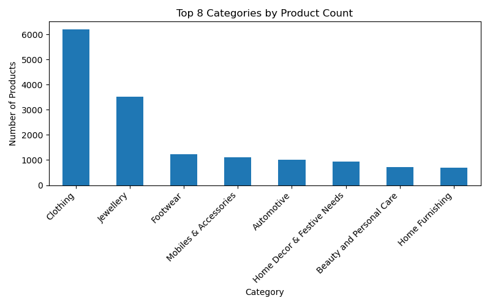
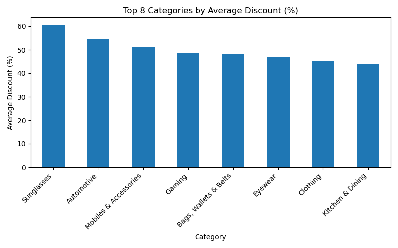
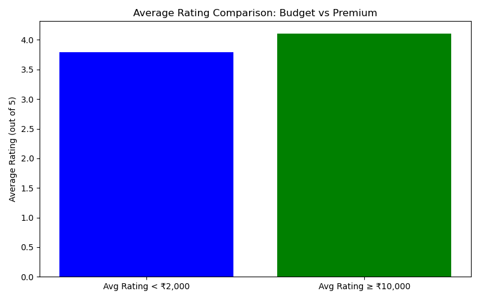

# Flipkart E-Commerce Product Analysis

## Project Overview

This project analyzes product trends, pricing strategies, and customer ratings across nearly 20,000 products on Flipkart using Python (pandas, matplotlib). The goal was to extract actionable business insights from a real-world e-commerce dataset and demonstrate advanced data wrangling, feature engineering, and visualization skills.

- **Project completed:** March 2025 (uploaded to GitHub April 2025)
- **Academic context:** Developed as part of the Google Advanced Data Analytics Certificate (Coursera, completed April 16, 2025, Credential ID: QCQQXEPZLW3K)
- **Dataset:** [Flipkart E-Commerce Sample (Kaggle)](https://www.kaggle.com/datasets/PromptCloudHQ/flipkart-products)

## Objectives

- Clean and structure a large e-commerce dataset
- Identify top product categories and those with the highest average discounts
- Analyze customer ratings for budget vs. premium products
- Generate clear, reproducible visualizations and a summary report

## Methodology

1. **Data Preparation:**  
   - Loaded and cleaned Flipkart product data from Kaggle
   - Extracted main product categories and filtered out sparse categories

2. **Business Metrics:**  
   - Top categories by product count
   - Categories with highest average discount
   - Average customer ratings for products under ₹2,000 and above ₹10,000

3. **Visualization:**  
   - Bar charts for category counts and discounts
   - Comparative bar chart for average ratings (budget vs premium)

## Key Results

- **Top Category:** Clothing (31.5% of listings)
- **Best Discounts:** Sunglasses (avg. 60.6% off)
- **Average Ratings:**  
  - Products under ₹2,000: 3.79 / 5  
  - Products ₹10,000 or more: 4.11 / 5

## Research & Visualizations

#### 1. Top 8 Categories by Product Count  

#### 2. Top 8 Categories by Average Discount (%)  

#### 3. Average Rating Comparison: Budget vs Premium  

## Files Included

- `flipcart_trend_analysis2.ipynb` – Jupyter notebook with all code, analysis, and visualizations
- `README.md` – This documentation
- 'images' - the visualisations produced

## Tools & Libraries Used

- Python 3.x
- pandas, numpy
- matplotlib

## Academic Context

- **Google Advanced Data Analytics Certificate** (Coursera, completed April 16, 2025)
- **Other Projects:**
  -Customer Churn Prediction: predicts customer churn for a telecom company using supervised machine learning.
  - EZTax WebApp: AI-driven tax analytics platform  
  - Tumor Detection with Explainable AI: Deep learning for medical imaging (April 2025)
  

## Contact

For questions or collaboration, connect on [LinkedIn](https://www.linkedin.com/in/jatinjayara/) or email [your.email@email.com].

---

*This project is part of my analytics portfolio and demonstrates my ability to deliver business insights from large, real-world datasets.*
